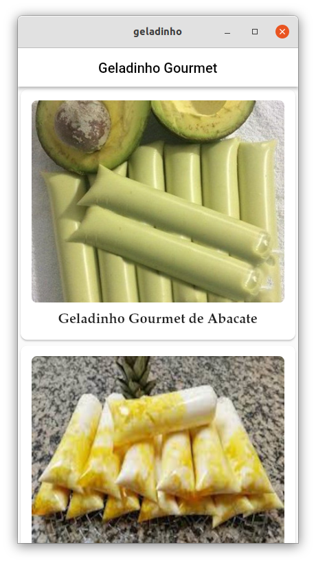
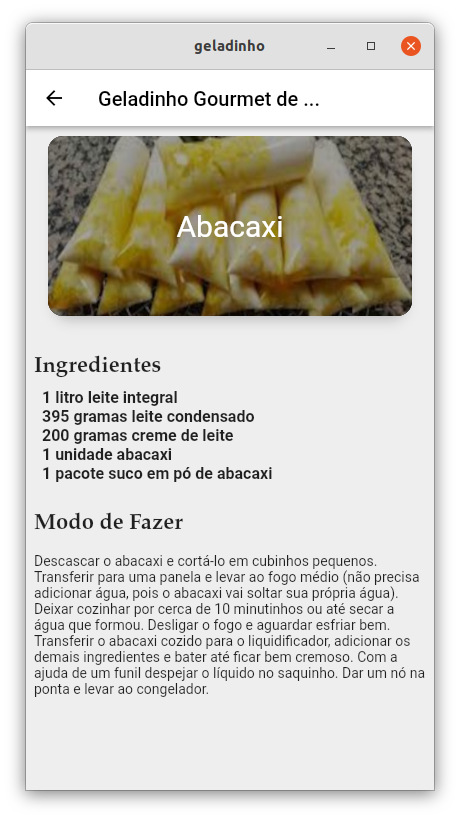

# Geladinho Gourmet

Projeto Flutter que mostra como utilizar listas e laços para obter dados a partir de um arquivo em formato JSon interno contendo receitas de Geladinho Gourmet.

## Especificações do Projeto

Este projeto é apenas para um estudo sobre aplicação Flutter e não possui qualquer interesse comercial. Na tela principal mostra as opções de diversos tipos de Geladinho Gourmet.

E ao selecionar qualquer tipo é possível ver os detalhes da receita, conforme a seguinte tela:

Todos os dados estão contidos em um arquivo interno (em formato JSon) do próprio aplicativo não sendo necessário qualquer conexão com a Internet ou uso de banco de dados.